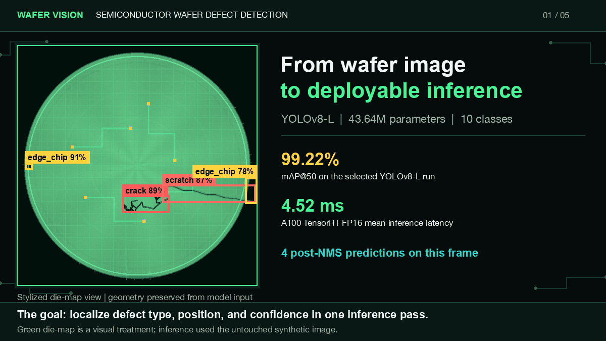
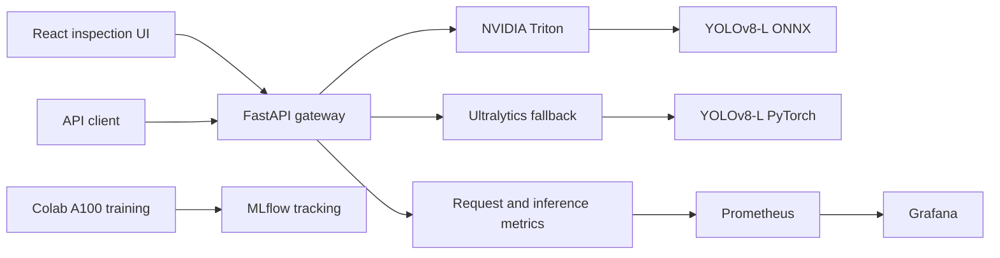

# YOLOv8 Semiconductor Wafer Defect Detection

[](https://github.com/Rajendar-Muddasani-2/yolo-object-detection/actions/workflows/ci.yml)
[](pyproject.toml)
[](https://docs.ultralytics.com/)
[](LICENSE)

GPU-trained object detection for semiconductor wafer inspection, with reproducible data generation, FastAPI serving, NVIDIA Triton deployment, a React inspection UI, and Prometheus/Grafana observability.

<p align="center">
  
</p>

<p align="center"><strong>One forward pass, ten defect classes, production-oriented serving.</strong></p>

## Results

### Detection quality

| Model | mAP@50 | mAP@50:95 | Precision | Recall | Parameters |
|---|---:|---:|---:|---:|---:|
| YOLOv8-S | 99.10% | 95.25% | 98.62% | 97.93% | 11.2M |
| YOLOv8-M | 99.16% | **96.05%** | 98.76% | 98.36% | 25.9M |
| **YOLOv8-L** | **99.22%** | 95.76% | **99.07%** | **98.61%** | 43.7M |

The reported training run used 20,000 procedurally generated wafer images across ten classes with a 70/15/15 split. The repository includes an MVTec AD conversion and merge pipeline, but MVTec samples were not part of the reported run because the automated dataset download did not complete. This distinction matters when interpreting the metrics and planning validation on fab data.

### GPU inference

| Backend | GPU | Precision | Mean latency | Throughput |
|---|---|---:|---:|---:|
| PyTorch | NVIDIA T4 | FP16 | 16.15 ms | 61.9 FPS |
| PyTorch | NVIDIA A100 | FP32 | 12.79 ms | 78.2 FPS |
| ONNX Runtime | NVIDIA A100 | FP32 | 9.15 ms | 109.3 FPS |
| TensorRT | NVIDIA A100 | FP16 | **4.52 ms** | **221.3 FPS** |

Benchmark artifacts are committed under [`outputs/gpu_stack_results`](outputs/gpu_stack_results) and [`outputs/tensorrt_results`](outputs/tensorrt_results). Latency excludes image transport and UI rendering.

## System Design



The API attempts Triton first and falls back to the local Ultralytics model when Triton is unavailable. Docker Compose connects the API to Triton through `triton:8000` and serves the populated ONNX model at version 1.

### Included capabilities

- Ten semiconductor defect classes: scratch, particle, edge chip, void, pattern shift, bridge, missing bond, crack, contamination, and delamination
- Deterministic synthetic wafer generation with YOLO annotations
- Optional MVTec AD mask-to-box conversion and dataset merge
- YOLOv8-S, YOLOv8-M, and YOLOv8-L comparison workflow
- PyTorch, ONNX Runtime, and TensorRT benchmark notebooks
- Single-image and batch REST inference
- API key and JWT authentication modes, rate limiting, and structured logging
- Seven-service Docker Compose stack
- Kubernetes manifests with API autoscaling
- Prometheus metrics, Grafana provisioning, and MLflow experiment tracking
- GitHub Actions checks across Python 3.10, 3.11, and 3.12

## Repository Layout

```text
.
├── .github/workflows/ci.yml         # Enforced lint and tests
├── frontend/                        # React, TypeScript, Vite, Nginx
├── k8s/                             # API, Triton, frontend, monitoring, HPA
├── models/                          # PyTorch and ONNX weights via Git LFS
├── monitoring/                      # Prometheus and Grafana configuration
├── notebooks/                       # Training and GPU benchmark workflows
├── outputs/                         # Curves, benchmarks, and inference evidence
├── scripts/                         # Inference, wafer generation, GIF generation
├── src/
│   ├── api/server.py                # FastAPI gateway and model fallback
│   ├── data_generator.py            # Synthetic wafer dataset generator
│   ├── mvtec_integration.py         # MVTec conversion and merge pipeline
│   └── yolo_utils.py                # Training, export, and benchmark utilities
├── tests/                           # API and model utility tests
├── triton_model_repo/               # Triton ONNX model repository
├── docker-compose.yml
├── Dockerfile
└── pyproject.toml
```

## Quick Start

### Prerequisites

- Python 3.10 to 3.12
- Git LFS
- Docker with the Compose plugin for the full stack
- NVIDIA Container Toolkit and an NVIDIA GPU for Triton

### Local Python environment

```bash
git clone https://github.com/Rajendar-Muddasani-2/yolo-object-detection.git
cd yolo-object-detection
git lfs install
git lfs pull

python3.12 -m venv .venv
source .venv/bin/activate
python -m pip install --upgrade pip
pip install -e ".[dev]"
```

### Run local inference

The included script processes the realistic unseen wafer set and writes annotated images to `outputs/realistic_unseen/annotated`.

```bash
python scripts/run_unseen_inference.py
```

### Run the API with local model fallback

```bash
AUTH_ENABLED=false uvicorn src.api.server:app --host 0.0.0.0 --port 8080
```

```bash
curl -X POST "http://localhost:8080/detect?confidence=0.25" \
  -F "file=@outputs/realistic_unseen/realistic_05.jpg"
```

Example response:

```json
{
  "image_name": "realistic_05.jpg",
  "detections": [
    {
      "class_name": "edge_chip",
      "class_id": 2,
      "confidence": 0.91,
      "bbox": [45.0, 210.0, 95.0, 260.0]
    }
  ],
  "inference_time_ms": 16.15,
  "total_defects": 1
}
```

Interactive API documentation is available at [http://localhost:8080/docs](http://localhost:8080/docs).

## Full GPU Stack

Copy the environment template, replace development secrets before enabling authentication, then start the stack:

```bash
cp .env.example .env
docker compose up --build -d
docker compose ps
```

| Service | URL or port | Purpose |
|---|---|---|
| React UI | [localhost:3000](http://localhost:3000) | Wafer upload and detection overlay |
| FastAPI | [localhost:8080](http://localhost:8080/docs) | REST gateway and local fallback |
| Triton HTTP | `localhost:8000` | ONNX inference |
| Triton gRPC | `localhost:8001` | High-throughput inference transport |
| MLflow | [localhost:5000](http://localhost:5000) | Experiment tracking |
| Prometheus | [localhost:9090](http://localhost:9090) | Metrics collection |
| Grafana | [localhost:3001](http://localhost:3001) | Operational dashboards |
| Redis | `localhost:6379` | Cache service |

The local Compose profile sets `AUTH_ENABLED=false` so the browser UI works without exposing a secret in frontend JavaScript. For a protected deployment, set `AUTH_ENABLED=true` in the API environment and send either `X-API-Key` or a Bearer token from a trusted client or gateway.

```bash
curl -H "X-API-Key: $API_KEY" \
  -F "file=@wafer.jpg" \
  http://localhost:8080/detect
```

## Data and Training

Generate a smaller local dataset for pipeline validation:

```bash
python -c "from src.data_generator import generate_dataset; generate_dataset('data/wafer_defects', n_images=1000)"
```

For the reported run, open [`notebooks/train_yolov8_colab.ipynb`](notebooks/train_yolov8_colab.ipynb) in Colab with an A100 runtime. The notebook covers data generation, optional MVTec conversion, model comparison, MLflow logging, ONNX export, and benchmark artifact generation.

TensorRT engines are tied to the CUDA, TensorRT, GPU, and Ultralytics environment that created them. The committed Triton service therefore uses portable ONNX model version 1. Rebuild TensorRT locally with [`notebooks/tensorrt_benchmark.ipynb`](notebooks/tensorrt_benchmark.ipynb) before deploying a plan file.

## API Surface

| Method | Endpoint | Description |
|---|---|---|
| `GET` | `/health` | Backend and model readiness |
| `GET` | `/classes` | Supported defect taxonomy |
| `GET` | `/metrics` | Service counters and latency state |
| `POST` | `/token` | Exchange an API key for a JWT |
| `POST` | `/detect` | Detect defects in one image |
| `POST` | `/detect/batch` | Detect defects in multiple images |

## Validation

```bash
ruff check src tests scripts
pytest tests/test_*.py -v --tb=short
docker compose config -q
```

Run the load workload separately after starting the API:

```bash
locust -f tests/load_test.py --host http://localhost:8080
```

## Scope and Limitations

- Reported accuracy is measured on held-out procedurally generated wafers. It is not a substitute for qualification on fab imagery across tools, lots, recipes, and process corners.
- The MVTec adapter demonstrates ingestion of licensed industrial anomaly data, but those images are not included in the reported metrics.
- The Compose stack requires NVIDIA GPU support for Triton. The direct FastAPI path can fall back to PyTorch or ONNX on CPU.
- Synthetic defects and demonstration images are intentionally included for reproducibility. Production deployment requires data governance, drift monitoring, calibration, and lot-level acceptance criteria.

## License

Released under the [MIT License](LICENSE).